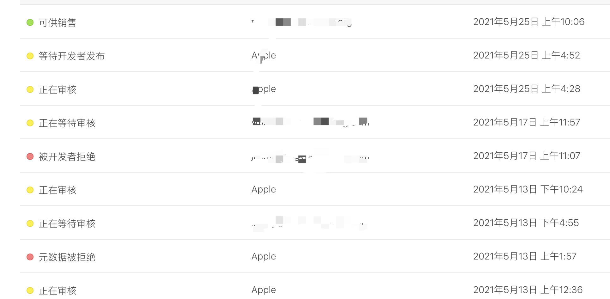
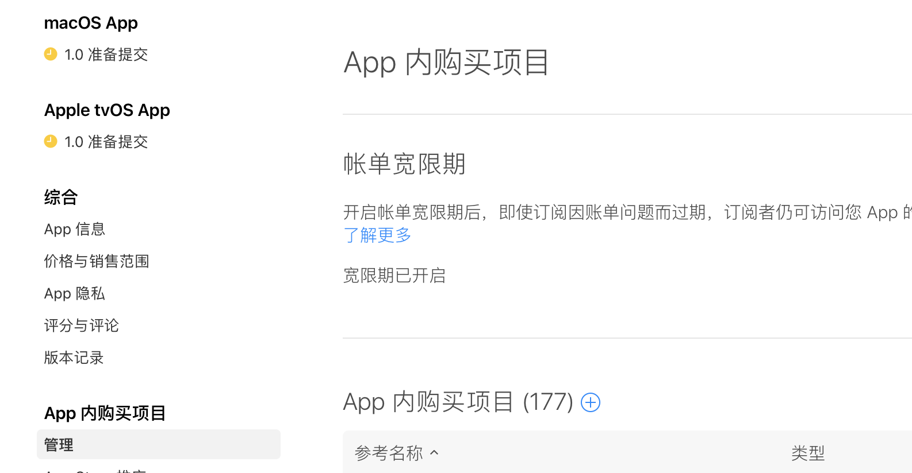

# 论Apple Store审核

## 审核流程总结

### 一、预审阶段

1. Info.plist配置文件扫描（即属性列表），iOS的APP都使用info.plist文件来储存元信息，用来实现决定bundle所显示的ICON，当前APP支持打开的文件类型，服务声明等，就是看plist配置文件字符是否有规范和缺失；
   主要分类为两步骤：
   第一步为上传苹果时苹果Application Loador等应用对于适配的图片规格属性和视频规格属性的检查，第二步为上传后苹果的功能检查。
2. 私有API扫描，私有API和Non-public API，是苹果明令禁止的条款，会使用反编译工具，对IPA的可执行文件进行反编译解析，获取头文件中库，方法和类的集合，再逐一对比私有库和non-public库。
   文件大小扫描，主要饱含ipa包的文件大小（小于2GB），可执行文件得正文段大小（解压ipa包后，要小于80MB）和包中每个文件的大小（检查每个文件得大小小于500MB）

### 二、机器审核阶段

1. 代码块扫描：
   AI编译器会对每个函数生成去识别函数名，类名，方法名，还有全局字符串引用表的扫描识别，主要是文本类的查重排重。
   1）这里需要针对不同的语言，进行不同的修改才能绕过苹果的识别库，比如函数增加一些默认参数。
   2）修改类名，方法名，属性名以及文件名这些。
2. 资源文件扫描：
   主要针对各个文件扫描出来的MD5进行对比。
   1）这里就要人工对各位小文件进行代码混淆，对资源文件轻压缩，改变hash值。
   2）资源改名，适当添加一些无用的资源。

### 三、人工审核阶段

1. 主要APP功能检测和体验检测，例如用测试账号登陆APP体验功能是否有bug。
2. ATT、IPV6、等各种权限相关也在此处检测。
3. 名称，副标题，应用截图，视频，ICON，应用描述等应用场景内容和功能的规范。

## 经验教训

###### 在苹果人工审核阶段，是属于黑盒审核，除了苹果的[审核指南](https://developer.apple.com/cn/app-store/review/guidelines/)可以有一定的指导意义，其他的一切都是苹果审核说了算（叫爸爸）。大多数被拒都是在此阶段发生，各种各样的姿势也是层出不穷，当然网络上也有各种针对被拒原因的办法，但也有无法检索到的参考的情况，所以在此记录一些特别的来自爸爸的教训

###### 坑不少，慢慢填😩

------

### 一、如果和版本一起提审的有新的商品，被拒后需要去商品页检查商品状态！

（上个月刚发生，仿佛回到了15赛季，苹果的一个审核周期长达两周😭

背景：该版本有ATT权限相关、有新的商品随之一起提审

提审后第一次被拒：ATT权限相关，我们只在注册阶段收集，苹果审核人员没有体验到，打回。随后我们立马回复了苹果，但是等了四五天一直没有再次审核的反应，以往经验是在苹果审核后台做了回复后一般第二天就会有结论。

骚操作：经验主义，苹果后台BUG了！我们撤回该版本再重新提审，应该很快就正常过审啦。以前确实这样做过，也确实很快就通过了审核🤔

五天后...毫无反应，经好心运营同事提醒才发现，商品列表详情页里面有个小红点，显示需要开发者处理.........

整个苹果后台页面没有任何有关商品出问题的提示（我们在等待审核期间还给苹果打了电话发了邮件询问审核缓慢的问题，结果答复都是正常流程，等着就行..），必须点进商品列表详情页，才能看到有关提示，简直了....

商品本身也没有问题，就是版本被拒后，商品给一起打回了，所以我把商品的名字和描述分别叫了个句号再保存，红点报错消失了，显示为黄色等待审核中.......

第二天，审核通过了。。