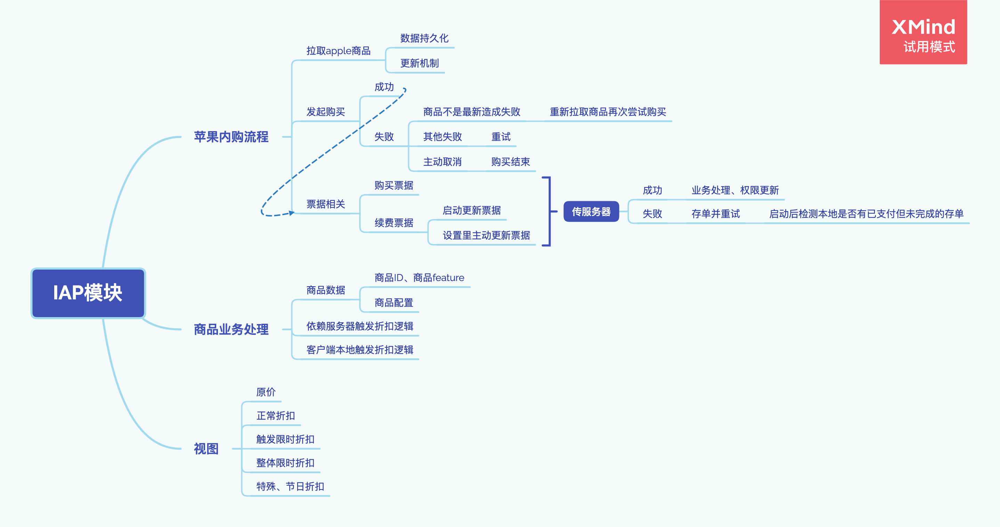

# IAP模块

## 来个图

## 苹果内购流程

### 拉取apple商品

- 数据持久化
- 更新机制

### 发起购买

- 成功
- 失败

  - 商品不是最新造成失败

    - 重新拉取商品再次尝试购买

  - 其他失败

    - 重试

  - 主动取消

    - 购买结束

### 票据相关

- 购买票据
- 续费票据

  - 启动更新票据
  - 设置里主动更新票据

## 商品业务处理

### 商品数据

- 商品ID、商品feature
- 商品配置

### 依赖服务器触发折扣逻辑

### 客户端本地触发折扣逻辑

## 视图

### 原价

### 正常折扣

### 触发限时折扣

### 整体限时折扣

### 特殊、节日折扣

